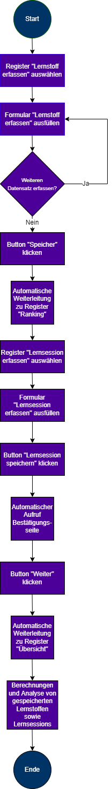

<h1>Webapplikation "Learnrocket"</h1>
<h2>1. Ausgangslage</h2>
In der Lernphase folgen die Prüfungstermine oft dicht aufeinander. Zeitgleiches Lernen für 
mehrere Fächer bleibt daher nicht aus, 
wenn man sich gerne gründliche vorbereiten möchte. Diese Lernphase führt teilweise dazu, dass sich Studierende
oft dem Lernstoff widmen, den sie ohnehin bereits beherrschen.

<h2>2. Projektidee</h2>
Mit dieser Webapplikation wird anfangs Semester dokumentiert, welche Fächer und deren Themen zu absolvieren sind. 
Der Anwender kann dabei den Beherrschungsgrad des jeweiligen Themas angeben. Anschliessend wird ein Ranking anhand des Beherrschungsgrades erstellt.
Somit weiss der Anwender genau, welche Fächer er intensiver lernen muss. Zusätzlich bietet die Applikation eine Erfassungs-Funktion
über absolvierte Lernsessions. Daraus können Rückschlüsse anhand Datenvisualisierungen gezogen werden.

<h2>3. Betrieb</h2>
Damit die Applikation korrekt funktioniert, müssen folgende Module importiert werden:
Flask (Flask, render_template, request, url_for, redirect)
Plotly (plotly.express as px)

<h2>4. Workflow</h2>

<h2>5. Architektur</h2>

<h3>5.1 Lernstoff erfassen</h3>
Der User gibt zu Beginn den zu absolvierenden Lernstoff an. 
Folgende Daten müssen eingetragen werden: 
Fach (Text)
Thema (Text)
Wie gut beherrst du das Thema..Sei ehrlich! (Auswahl)

Der Anwender kann danach den Datensatz abspeichern, oder weiteren Lernstoff erfassen.

<h3>5.2 Ranking</h3>
Sobald der Lernstoff erfasst wurde, wird der User auf das Ranking weitergeleitet. 
Darauf werden die Datensätze nach Beherrschungsgrad gegordnet. 
Lernstoffe mit den Beherrschunggraden "Sehr schlecht" und "Schlecht" ranken zuoberst.

Der Anwender kann danach den Datensatz abspeichern, oder weiteren Lernstoff erfassen.

<h3>5.3 Lernsession erfassen</h3>
Der User kann seine absolvierten Lernsession erfassen. Folgende Daten müssen eingegeben werden:
Welches Fach hast du gelernt?
Welches Thema hast du gelernt?
Wie lange hast du gelernt (in min)?
Wie gut beherrst du den Lernstoff..Sei ehrlich! (Auswahl)
Die Eingabe wird mit dem Klick auf den Button "Lernsession speichern" gespeichert.
Wird ein Feld leer gelassen, erscheint eine Fehlermeldung
Das Feld für die Minutenangaben benötigt eine Zahleneingabe. 
Dafür wird ebenfalls eine Logik eingebaut, welche nur einen Wert der grösser als 1 ist akzeptiert. 
Andernfalls erscheint eine Fehlermeldung.

<h3>5.4 Übersicht</h3>
Die gespeicherten Lernstoffe und Lernsessions werden auf der Übersichtsseite anhand Analysen nochmals dargestellt.

Folgende Gebiete können über den gesamten Container abgefragt werden: 
Dieses Thema beherrschst du am besten (Analyse Lernsession). 
Dieses Thema musst du dir nochmals ansehen (Analyse Lernsession). 
So viel Zeit hast du pro Fach investiert (Analyse Lernsession). 
Datenvisualisierung über Anzahl Beherrschungsgrade der Lernstoffe (Analyse Lernstoffe).

<h2>6. Funktionen</h2>
Dateneingabe: Lernstoff erfassen / Lernsession erfassen
Datenspeicherung: Lernstoffe und Lernsessions werden in einer JSON-Datei gespeichert.
Datenverarbeitung: Das Ranking wird mittels For-Schleife aus der Datenbank berechnet.
Datenausgabe: Ranking wird aus der Datenverarbeitung ausgegeben. 
Ausgabe des Fachs/Themas, mit höchster Lernzeit, 
Ausgabe des Fachs/Themas, mit bester Beherrschung, 
Ausgabe des Fachs/Themas, mit niedrigster Beherrschung